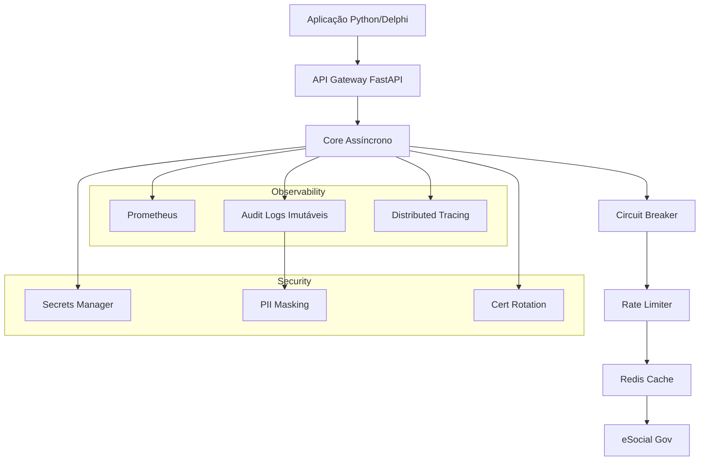

# 🚀 LIBeSocial Premium Enterprise v2.0.0

> **A solução definitiva para integração com o eSocial em Python e Delphi.**
>
> Uma biblioteca enterprise-grade completa, assíncrona, segura e observável, projetada para alta performance, conformidade total com as normas do eSocial e integração perfeita com ecossistemas legados (Delphi).

[](https://www.python.org/downloads/)
[](LICENSE)
[](https://github.com/libesocial/premium/actions)
[](https://github.com/libesocial/premium)
[](https://github.com/psf/black)
[](integracao/delphi/)

---

## 🌟 Destaques Premium

- ⚡ **Alta Performance**: Cliente HTTP assíncrono (`httpx`) com connection pooling e caching Redis.
- 🛡️ **Segurança Enterprise**: Gerenciamento de segredos (AWS/Azure/Vault), logs de auditoria imutáveis (hash chain) e máscara automática de PII.
- 🔄 **Resiliência Total**: Circuit Breaker, Rate Limiting, Retry Exponencial e Dead Letter Queue (DLQ).
- 👁️ **Observabilidade Completa**: Métricas Prometheus, Health Checks, Distributed Tracing (Jaeger/Zipkin) e Alertas configuráveis.
- 🐳 **Cloud Native**: Pronto para Docker, Kubernetes e CI/CD automatizado.
- 🔌 **Extensível**: Sistema de Plugins para carregar lógica customizada dinamicamente.
- 📡 **Integração Delphi**: SDK nativo e API Gateway REST para conectar aplicações Pascal modernas.
- 📊 **Dashboard em Tempo Real**: Interface web Streamlit para monitoramento operacional.

---

## 📑 Índice

1. [Instalação Rápida](#-instalação-rápida)
2. [Primeiros Passos](#-primeiros-passos)
3. [Arquitetura Premium](#-arquitetura-premium)
4. [Funcionalidades Core](#-funcionalidades-core)
5. [Integração Delphi](#-integração-delphi)
6. [Monitoramento & Dashboard](#-monitoramento--dashboard)
7. [Deploy & DevOps](#-deploy--devops)
8. [Documentação Completa](#-documentação-completa)
9. [Roadmap & Contribuição](#-roadmap--contribuição)

---

## 🚀 Instalação Rápida

### Via PyPI (Recomendado)
```bash
pip install libesocial-premium
```

### Via Docker (Imediato)
```bash
docker run --rm -it libesocial/premium:latest esocial-cli --version
```

### Via Fonte (Desenvolvimento)
```bash
git clone https://github.com/libesocial/premium.git
cd premium
pip install -e ".[dev]"
```

### Pré-requisitos
- Python 3.9+
- Redis (para caching e filas)
- (Opcional) Delphi 10.4+ para integração legado

---

## 💻 Primeiros Passos

### 1. Configuração Inicial
Configure suas credenciais de forma segura via variáveis de ambiente ou AWS Secrets Manager:

```bash
export ESOCIAL_AMBIENTE="PRODUCAO"
export ESOCIAL_CNPJ_EMPRESA="00.000.000/0000-00"
export ESOCIAL_CERT_PATH="/path/to/cert.pfx"
export ESOCIAL_CERT_PASSWORD="sua_senha_segura"
# Ou use o comando de init automático
esocial-cli init-config --provider aws
```

### 2. Validação e Envio de Eventos
Exemplo simples usando a API Assíncrona:

```python
import asyncio
from esocial import AsyncClient, EventoS1000

async def main():
    async with AsyncClient() as client:
        # Criar evento S-1000 tipado
        evento = EventoS1000(
            ide_empregador={"tp_insc": 1, "nr_insc": "00000000000000"},
            info_empresa={"ide_periodo": {"ini_valid": "2024-01-01", "fim_valid": ""}, ...}
        )

        # Validar localmente (XSD + Regras de Negócio)
        validacao = await client.validate(evento)
        if validacao.is_valid:
            print("✅ Validação OK")

            # Enviar para o eSocial
            resposta = await client.submit(evento)
            print(f"📬 Enviado! Recibo: {resposta.recibo}")
        else:
            print(f"❌ Erros: {validacao.errors}")

asyncio.run(main())
```

### 3. Uso via CLI
Operações rápidas sem escrever código:

```bash
# Validar um arquivo XML/JSON
esocial-cli validate evento_s1000.json

# Enviar lote de eventos
esocial-cli submit --batch eventos/

# Consultar status de um recibo
esocial-cli status --recibo 1.2.3456789

# Ver saúde do sistema
esocial-cli health
```

---

## 🏗️ Arquitetura Premium

O LIBeSocial foi desenhado com padrões de arquitetura robustos para garantir estabilidade em missão crítica:



### Componentes Chave
| Módulo | Descrição | Status |
|--------|-----------|--------|
| `esocial.async_client` | Cliente HTTPX com retry e pooling | ✅ Premium |
| `esocial.circuit_breaker` | Padrão Resilience4j-like | ✅ Premium |
| `esocial.secrets` | Abstração AWS/Azure/Vault | ✅ Premium |
| `esocial.audit` | Logs blockchain-style com HMAC | ✅ Premium |
| `esocial.webhooks_server` | Servidor de notificações push | ✅ Premium |
| `esocial.plugins` | Loader dinâmico de extensões | ✅ Premium |

---

## 🔌 Integração Delphi

Conecte sua aplicação Delphi (Win32/Win64) ao poder do Python de forma transparente.

### Opção A: SDK Delphi Nativo (Recomendado)
Utilize nossa unit `uEsocialSDK.pas` que encapsula chamadas REST à API Gateway.

```pascal
uses uEsocialSDK, System.JSON;

var
  SDK: TEsocialSDK;
  Response: TJSONObject;
begin
  SDK := TEsocialSDK.Create('http://localhost:8000/api/v1');
  try
    SDK.Authenticate('SEU_TOKEN');

    // Enviar Evento S-1000
    Response := SDK.SubmitEvent('S-1000', JsonContent);
    if Response.GetValue('success').AsBoolean then
      ShowMessage('Enviado com sucesso! Recibo: ' + Response.GetValue('receipt').AsString)
    else
      ShowMessage('Erro: ' + Response.GetValue('error').AsString);
  finally
    SDK.Free;
  end;
end;
```

### Opção B: API Gateway REST
Chame diretamente os endpoints HTTP da biblioteca Python rodando como serviço.
- **Base URL**: `http://seu-servidor:8000/api/v1`
- **Auth**: Bearer Token ou API Key
- **Formato**: JSON

📂 **Veja o projeto exemplo completo** em [`integracao/delphi/demo/`](integracao/delphi/demo/) incluindo formulário VCL/FMX funcional.

---

## 📊 Monitoramento & Dashboard

Visualize métricas, logs e status em tempo real.

### Dashboard Web (Streamlit)
Execute o dashboard localmente:
```bash
streamlit run dashboard.py
```
**Recursos:**
- Gráficos de envio por tipo de evento (S-1000, S-1200, S-2200, etc.)
- Mapa de calor de erros e retrys
- Status de saúde dos conectores
- Visualizador de Logs de Auditoria com busca

### Métricas Prometheus
Acesse `http://localhost:8000/metrics` para integrar com Grafana.
Métricas incluídas:
- `esocial_events_submitted_total`
- `esocial_api_latency_seconds`
- `esocial_circuit_breaker_state`
- `esocial_audit_logs_count`

---

## 🐳 Deploy & DevOps

### Docker Compose
Suba toda a stack (App, Redis, Dashboard, Webhooks) com um comando:

```bash
docker-compose --profile full up -d
```
*Perfis disponíveis: `basic` (app+redis), `monitoring` (+prometheus+grafana), `full` (tudo).*

### Kubernetes
Manifestos e Helm Charts prontos para produção em [`k8s/`](k8s/).
```bash
helm install libesocial ./k8s/helm-chart --values values-prod.yaml
```

### CI/CD
Pipeline automatizado via GitHub Actions:
- Testes unitários e de integração a cada commit.
- Scan de segurança (Bandit/Safety).
- Build e push de imagens Docker.
- Release automático no PyPI ao criar tag `v*`.

---

## 📚 Documentação Completa

A documentação detalhada está disponível em formatos múltiplos:

1. **Site Oficial (MkDocs)**: `docs/site/` (Gere com `mkdocs serve`)
   - Tutoriais passo-a-passo
   - Referência completa da API
   - Guias de migração

2. **SDK Delphi**:
   - `integracao/delphi/docs/SDK_Delphi_eSocial.pdf` (Guia em PDF)
   - Comentários inline no código fonte `.pas`

3. **Guias Específicos**:
   - [Guia de Segurança e Segredos](docs/security.md)
   - [Configurando Auditoria](docs/audit.md)
   - [Integração com ERP Legado](docs/integration.md)

---

## 🛣️ Roadmap & Contribuição

### Versão Atual: v2.0.0 (Premium Enterprise)
- ✅ Fases 1-6 Completas
- ✅ Integração Delphi
- ✅ Dashboard & Webhooks

### Próximos Passos (v2.1.0)
- [ ] Suporte a Multi-Tenant (SaaS)
- [ ] Plugin Store oficial
- [ ] UI Web Admin (React/Vue)
- [ ] Conectores para outros gov (ReceitaFGTS, DCTFWeb)

### Como Contribuir
1. Fork o projeto
2. Crie uma branch (`git checkout -b feature/nova-funcionalidade`)
3. Commit suas mudanças (`git commit -m 'feat: adiciona nova funcionalidade'`)
4. Push (`git push origin feature/nova-funcionalidade`)
5. Abra um Pull Request

---

## 📞 Suporte & Comunidade

- **Issues**: [GitHub Issues](https://github.com/libesocial/premium/issues)
- **Discord**: [Comunidade Dev](https://discord.gg/libesocial)
- **Email Comercial**: enterprise@libesocial.dev

---

## 📄 Licença

Distribuído sob a licença **MIT**. Veja `LICENSE` para mais informações.

**LIBeSocial Premium Enterprise** - Construído com ❤️ para a comunidade brasileira de desenvolvimento.
